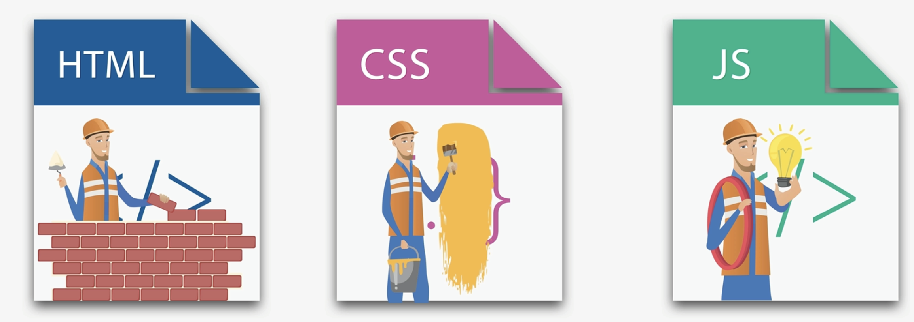

# Section: 1 [ Front-End Web development ]

### HTML File → ***Content***
### CSS File → ***Style***
### JavaScript File → ***Functionality***

ex:-

#### for example if website is a house then HTML would be bricks, CSS would be colour & decoration of the house and JavaScript would be functionalities ( i.e. light-on-off, door-open-close etc.. )