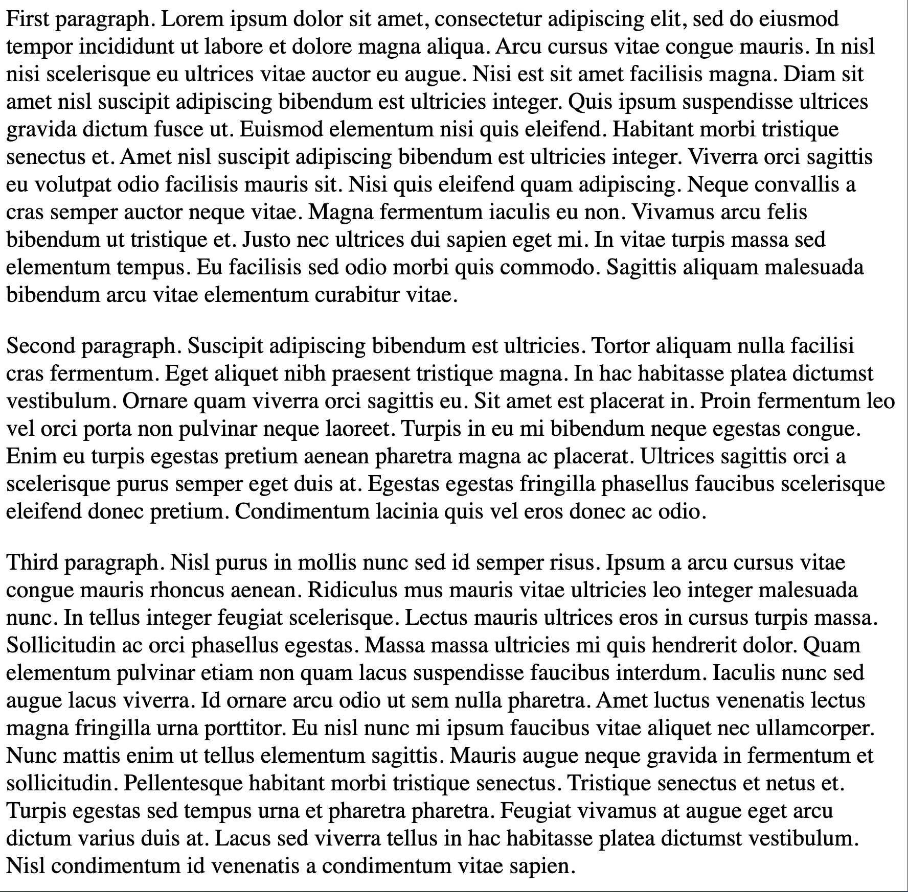

# 2.2 Paragraph Element

<table>
<tr>
<td>Element</td>
<td>Description</td>
</tr>
<tr>
<td>p</td>
<td>used to denote the paragraph</td>
</tr>
</table>

### Exercise:

<table>

<tr>
<td>Goal</td>
<td>Code</td>
</tr>

<tr>
<td style="width: 50%;"></td>
<td>

```html

<p>First paragraph. Lorem ipsum dolor sit amet, consectetur adipiscing elit, sed do eiusmod tempor incididunt ut labore et dolore magna...
</p>

<p>
Second paragraph. Suscipit adipiscing bibendum est ultricies. Tortor aliquam nulla facilisi cras fermentum. Eget aliquet nibh praesent...
</p>

<p>
Third paragraph. Nisl purus in mollis nunc sed id semper risus. Ipsum a arcu cursus vitae congue mauris rhoncus aenean. Ridiculus mus...
</p>

```

</td>
</tr>
</table>