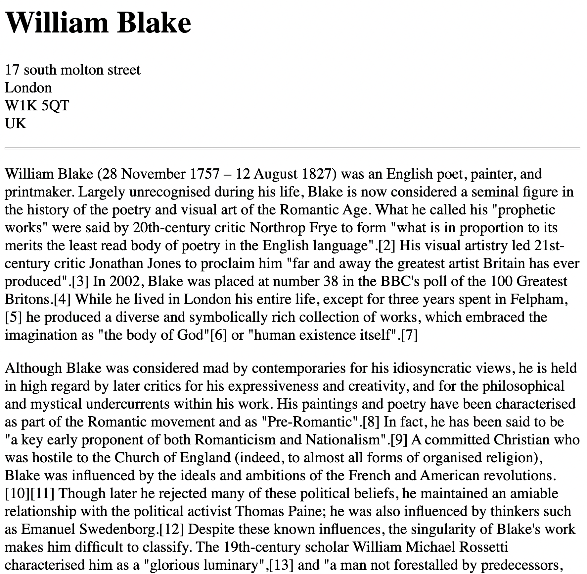

# 2.2 Void Elements

elements that forbids any content inside them


<table>
<tr>
<td>Element</td>
<td>Description</td>
</tr>
<tr>
<td>hr</td>
<td>horizontal rule</td>
</tr>

<tr>
<td>br</td>
<td>break element</td>
</tr>

<tr>
<td>img</td>
<td>image element</td>
</tr>

</table>

### Exercise:

<table>

<tr>
<td>Goal</td>
<td>Code</td>
</tr>

<tr>
<td style="width: 50%;"></td>
<td>

```html

<h1>William Blake </h1>

<p>17 south molton street <br/>
    London <br/>
    W1K 5QT <br/>
    UK <br/></p>

<hr/>

<p>William Blake (28 November 1757 – 12 August 1827) was an English poet, 
    painter, and printmaker. Largely unrecognised
    during his life, Blake is now considered a..
    </p>


<p>Although Blake was considered mad by contemporaries for his idiosyncratic views, 
    he is held in high regard by later
    critics for his expressiveness and creativity, and for 
    the philosophical and mystical undercurrents within his work. His...
    </p>


```

</td>
</tr>
</table>